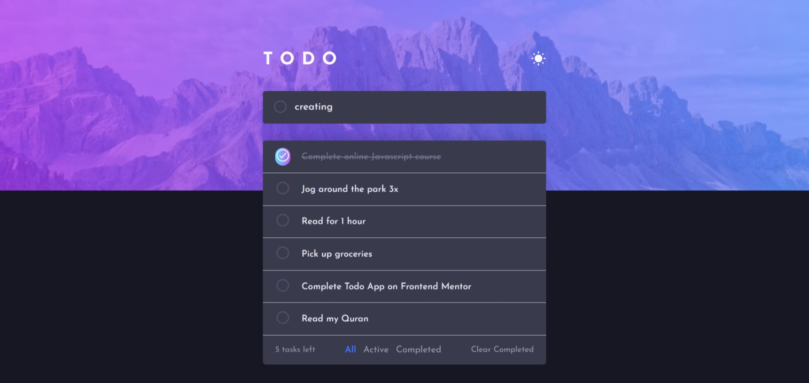

# Frontend Mentor - Goal Guru

This is a solution to the [Todo app challenge on Frontend Mentor](https://www.frontendmentor.io/challenges/todo-app-Su1_KokOW). Frontend Mentor challenges help you improve your coding skills by building realistic projects. 

## Table of contents

- [Overview](#overview)
  - [The challenge](#the-challenge)
  - [Screenshot](#screenshot)
  - [Links](#links)
- [My process](#my-process)
  - [Built with](#built-with)
  - [Continued development](#Continued-development)
- [Author](#author)


## Overview

GoalGuru is an intuitive and engaging task management application designed to help users efficiently manage and achieve their goals. With a sleek and modern interface, GoalGuru offers a streamlined approach to organizing daily tasks

### The challenge

Users should be able to:

- View the optimal layout for the app depending on their device's screen size
- See hover states for all interactive elements on the page
- Add new todos to the list
- Mark todos as complete
- Delete todos from the list
- Filter by all/active/complete todos
- Clear all completed todos
- Toggle light and dark mode

### Screenshot


![]./src/assest/2.jpeg


### Links

- Solution URL: [Add solution URL here](https://github.com/Tomtiko04/Goal-Guru)
- Live Site URL: [Add live site URL here](https://goal-guru.vercel.app/)

## My process

1. Frontend Development
2. Functionality Implementation
3. Integration and Testing
4. Deployment

### Built with

- Semantic HTML5 markup
- CSS custom properties
- Flexbox
- Mobile-first workflow
- [Vue](https://vuejs.org/) - JS library


### Continued development

- Mobile App Development
- Collaboration and Team Features
- Advanced Analytics and Reporting
- AI-Powered Task Suggestions
- Integration with Third-Party Apps


## Author

- Website - [Goal Guru](https://goal-guru.vercel.app/)
- Frontend Mentor - [@yourusername](https://www.frontendmentor.io/profile/Tomtiko04)


## Starting Guide 

This template should help get you started developing with Vue 3 in Vite.

## Recommended IDE Setup

[VSCode](https://code.visualstudio.com/) + [Volar](https://marketplace.visualstudio.com/items?itemName=Vue.volar) (and disable Vetur).

## Customize configuration

See [Vite Configuration Reference](https://vitejs.dev/config/).

## Project Setup

```sh
npm install
```

### Compile and Hot-Reload for Development

```sh
npm run dev
```

### Compile and Minify for Production

```sh
npm run build
```
